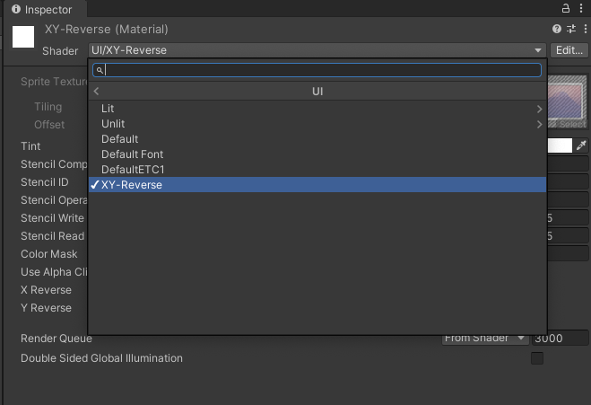
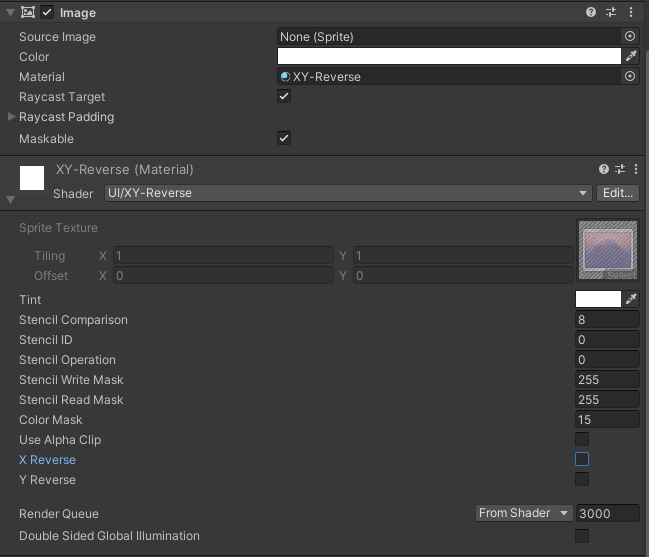

# XY Reverse Shader

Unity uGUI Shader for reversing X,Y axis of uGUI image.
The shader is created from uGUI default shader.

# Install

Add package on Packages/manifest.json

```
{
  "dependencies": {
    "me.mattak.xy-reverse-shader": "https://github.com/mattak/XYReverseShader.git?path=Assets/XYReverseShader"
  }
}
```

# Usage

1. Create material with Shader: UI/XY-Reverse



2. Set material to uGUI Image and toggle X,Y Reverse property.




